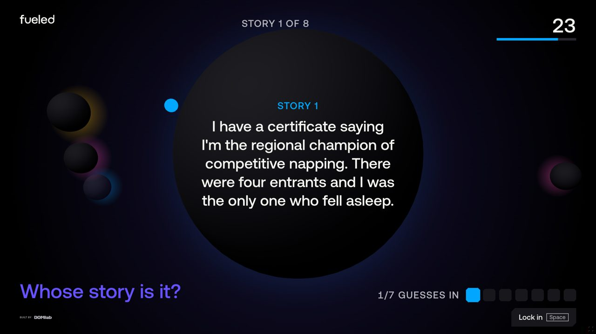
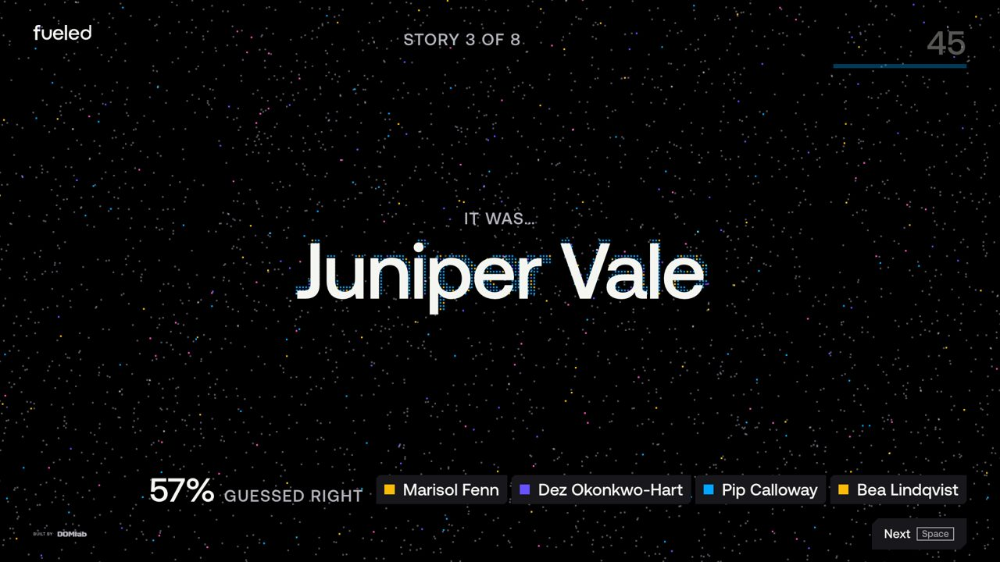
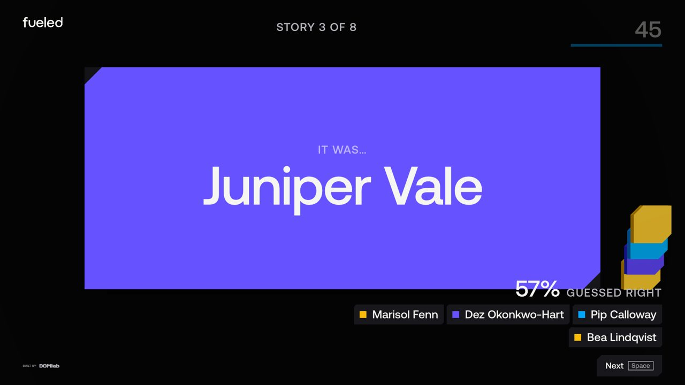
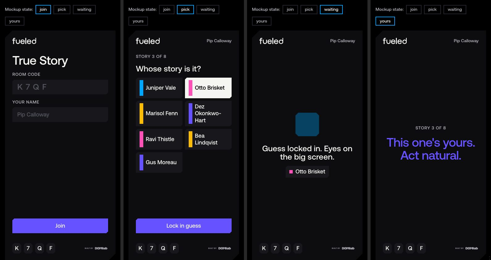

# Phase 0 mockups

**Decision: Deck.** Orbit and Signal are kept as alternates (same `SceneProps`, so they could become themes later).

Run `npm run dev` and open `/`. It walks through the game in order. **Start with `/demo`**: the host screen and one player's phone side by side, synced live.

| Route | What it is |
|---|---|
| `/` | The flow, step by step, with links to each host and phone screen |
| `/demo` | **Synced walkthrough:** host (left) and phone (right) in one page |
| `/create` | Host setup: pack, paste entries (live-parsed), timer, scoring, host-only mode |
| `/create?screen=lobby` | Lobby for the shared screen: room code, QR placeholder, players arriving |
| `/deck` | Host round loop (Deck), boot screen, reveal, then the finale after the last entry |
| `/play` | Player app: join, lobby, guess (with the entry on screen), waiting/result, yours, final place |
| `/orbit`, `/signal` | Alternate concepts we didn't pick |

**Host keys:** Space = next step, L = lock, R = reveal, F = full screen.

**Deep links:**
- `?timer=15` for faster rounds.
- `?at=guessing|locked|reveal|finale&item=3` to jump to a phase.
- `?motion=reduced` to force reduced motion.
- `/play?screen=lobby|pick|waiting|yours|final` to open a phone state.

Screenshots are in [`docs/mockups/`](docs/mockups/), numbered in flow order.

## Round 2 (after picking Deck)

- **Workflow:**
  - `/` is now the flow, in order.
  - `/demo` runs host and phone together over `BroadcastChannel` (`src/mock/demoSync.ts`, mock-only; Phase 1's `local` transport replaces it). Join on the phone, open the lobby and start on the host, and your guess counts on the big screen.
- **Create a game** (`/create`): `engine/intake.ts` parses `Name | entry` lines, plus tab or comma for spreadsheet pastes, with per-line errors. The lobby is stage-scaled like the host, so it reads on a screen share.
- **Scoring with places:**
  - `engine/scoring.ts` adds `computeStandings`: 100 points per correct guess, plus 50 to the owner for each player fooled, configurable per pack.
  - Ranking is standard competition style: equal scores share a place (1, 2, 2, 4).
  - `computeAwards` gives Best Detective, Most Mysterious and Fooled the Room.
  - The finale shows a podium, the full standings and the awards. Phones show your place, your points and the winner.
- **Phone shows the entry.** The guess screen puts the entry on a white card above the names, and the waiting and yours screens repeat it compactly, so nobody has to remember it.
- **Responsive:**
  - The host has a portrait stage (1080×1920) alongside landscape (1920×1080), shared by the HUD and the 3D scene through `ui/stage.ts`.
  - Host type sizes never drop below the phone sizes.
  - On ultrawide screens the HUD stays centered on the stage.
  - `/play` turns into a wide app layout from 768 px (3-column name grid, bigger type).
- **Chips** land as separate tiles in a "pot" (a 2-column grid right of the card, or a row below it in portrait), instead of the overlapping stack.
- **Boot screen** while the Three.js chunk loads:
  - A riffling chamfered deck, an animated scan bar, and a wipe-out on the chamfer diagonal.
  - It stays up at least `duration.boot-min` so it never just flickers.
  - Reduced-motion variant.
- **Native feel:**
  - `index.html` gets `theme-color` and a background from the tokens, so there's no white flash.
  - No overscroll bounce or tap highlight, plus safe-area padding.
  - View Transitions between phone screens.
  - Haptic tick on lock-in (Android).
  - Full screen (F) and Screen Wake Lock on the host.
- **Accessibility:**
  - Native radios for the guess grid and settings. Labelled inputs with hints and errors.
  - Focus moves to each new phone screen's heading.
  - A polite live region narrates the host round.
  - The canvas is hidden from assistive tech, and faded-out text is `aria-hidden`.
  - Chamfered controls get an inset focus ring, because `clip-path` was clipping outlines, which made focus invisible.
  - `forced-colors` support.
  - Scaled host buttons never go below a 48 px tap target.
  - axe-core (WCAG 2.2 AA + best practice) is clean on every route at 1440×900, and on `/play` at 390×844. See the build log for the one WebGL false positive.
- **"Built by DOM lab"** is about twice the size, with the DOM lab mark at full text color. It's on every host screen, including the finale and lobby.

## What's shared (carries into Phase 1)

- **`tokens/tokens.json`** (DTCG) feeds a Vite plugin, which generates `src/tokens/tokens.css` (custom properties) and `src/tokens/tokens.ts` (typed values for Three.js). Saving the JSON regenerates both while the dev server is running. Switching `color.accent` to Solar reskins the HUD and the 3D card in one edit (`docs/mockups/token-swap-deck.jpg`).
- **`src/engine/`**: types, a pure round reducer (`showing → guessing → locked → reveal → next`, including the can't-guess-your-own-entry rule), and reveal scoring.
- **`src/ui/`**: Button, CodeChip, NameGrid, Timer, GuessTicker, RevealPanel, PlayerChip, ItemText, and the logos (DOM lab and Fueled wordmark as `currentColor`, via a `?mono` SVG import). Shared `.chamfer` / `.chamfer-all` clip-path classes carry the DOM lab motif.
- **`src/scenes/Scene.ts`**: `SceneProps { phase, item, players, guesses, reveal, copy, reducedMotion }`. `toSceneProps` redacts the round state so guess targets and the owner only appear at reveal.
- **`src/scenes/shared/`** (`SceneCanvas`, `stage.ts`, `SceneOverlay`):
  - DPR capped at 2.
  - Render loop paused while the tab is hidden.
  - Stage pixels mapped to world units, so 3D objects and HTML overlays line up at any aspect ratio.
- **`src/mock/`**: 8 fictional players and 8 entries, plus `useMockRound`, which simulates guesses with a seeded RNG so rounds are repeatable.

In all three concepts, the entry text and the owner's name are **crisp HTML over the canvas**, never 3D text. The 3D is atmosphere and choreography. That keeps the text legible after Meet compresses it, keeps it accessible, and keeps it identical across concepts.

## Bundle sizes (gzipped JS, `vite build`)

| Route | Total | Breakdown |
|---|---|---|
| `/` picker | ~73 KB | React app shell 69.9 + picker 0.8 + logos 2.3 |
| `/play` | **~82 KB** (round 2) | shell 70.1 + Play 3.1 + shared UI ~8.6. **No Three.js** in the graph (checked in the build output). |
| `/create`, `/demo` | ~82 KB / ~76 KB | No Three.js. `/demo` loads the host and phone pages in iframes. |
| `/deck` | ~330 KB (round 2) | shell 70.1 + host 5.7 + shared UI ~8.6 + Three/R3F/drei 242.5 (lazy) + scene 2.2 |
| `/orbit` | ~324 KB | same, scene 2.9 (+ emblem SVG fetched as a 11 KB asset) |
| `/signal` | ~323 KB | same, scene 2.5 |

On `/host` routes the shell (header, timer, ticker) paints before the Three.js chunk arrives, because scenes are dynamically imported. The three concepts are **the same size**: Three.js dominates, and each scene is only 2 to 3 KB. So "fastest to load" doesn't separate them. Runtime cost does.

---

## Orbit

**Summary:**
- Each entry is a dark planet orbiting the Fueled emblem, with a soft glow in a Fueled secondary.
- The active planet pulls forward to center and becomes the surface the text resolves onto.
- Each guess spawns a moon around it.
- On reveal, correct guessers' moons stream into the planet as colored sparks, wrong ones drift off into space, and the owner's name appears on the planet.

**On a screen share:**
- One big dark disc with high-contrast text in the middle.
- The moons are large, solid Cryo dots, so each "guess received" registers even at low frame rates.
- The motion is slow and large-scale.

**Performance risks:**
- Low GPU cost (8 spheres, a handful of sprites, ~250 spark points).
- Additive glows can band under video compression.
- **Brand risk:** the emblem sits behind the active planet, so it's mostly visible only between rounds. The "orbiting the emblem" idea reads weakly in the middle of a round.
- Planets are colored by entry index, not by owner, so they can't leak the answer. That also means the colors carry no meaning.

## Signal

**Summary:**
- A 7,000-particle noise field.
- The entry's glyphs are sampled from the **live DOM layout**, word by word, so particles fly in and assemble exactly where the crisp HTML text then fades in.
- Each guess sends a Cryo pulse ring through the field.
- Locking snaps the field to a lattice.
- On reveal, the particles reorganize into the owner's name, with the correct guessers' colors mixed in.

It's the most "DOM lab" of the three.

**On a screen share:** the payoff moment (text or name assembling) is large and lasts about 1.5 s. After the handoff, the particles step back to a dim color so the HTML text carries legibility.

**Performance risks:**
- **Highest of the three.** It runs 7,000 CPU particle updates per frame (fine on a modern laptop, but that laptop is also encoding Meet).
- Dense, small, moving dots are exactly what video compression smears into noise, so the ambient field will look muddier on the call than locally.
- Sampling depends on fonts loading and on layout. It re-samples on resize.

## Deck

**Summary:**
- A Perfect White card with the DOM lab chamfered corners is dealt onto a dark table with some weight: a slide-in with rotation and a drop shadow.
- Each guess drops an anonymous grey chip onto a stack beside it.
- Lock presses the card into the table.
- Reveal flips the card, with a lift mid-flip, to a Nebula back with the owner's name. The chips take on guesser colors, correct chips restack, and wrong ones slide off the table.

**On a screen share:**
- **Best of the three.** Black text on a near-white card is the highest-contrast surface we have.
- The flip is a single big, unmistakable event that survives a choppy frame rate.
- Almost nothing moves while people are reading.

**Performance risks:**
- Lowest: a handful of meshes and no per-frame loops over large arrays.
- The flat card faces are unlit, so token colors render exactly.
- The main risk is taste: it's the least "wow" of the three.

## Phone (`/play`)

The four states are:
- **Join:** room code + name.
- **Pick:** a 2-column NameGrid with 48 px+ targets. You can't pick yourself.
- **Waiting:** shows your locked pick.
- **Yours:** "This one's yours. Act natural."

All copy comes from the pack JSON or the generic `UI_COPY`. A mockup-only state switcher sits above the phone frame.

---

## Recommendation: build Deck

Deck is the concept most likely to work on Thursday:
- **Legibility:** it has the highest-contrast reading surface on a compressed Meet stream.
- **Reveal:** the flip is one big moment that stays readable even at a low frame rate.
- **Risk:** it carries the least runtime risk on a laptop that is also screen-sharing.
- **Brand:** the chamfered card and chips put the DOM lab motif in the system itself, not just the logo.
- **Fallback:** it's nearly 2D already, so the Phase 3 `flat` reduced-motion scene is basically "the card without the flip".

Orbit's spark stream and Signal's name assembly are worth keeping as selectable v2 themes. Because they share the same `SceneProps`, that's a drop-in later rather than a rewrite.
